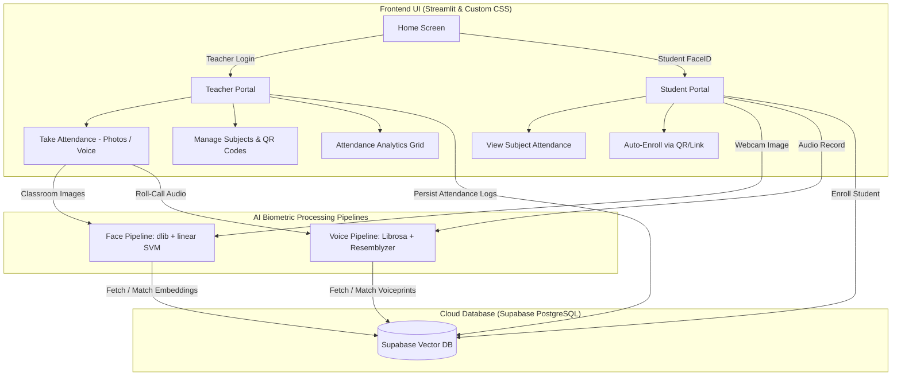

# 🎯 MarkIt — Multimodal AI Biometric Attendance System

[](https://www.python.org/)
[](https://streamlit.io/)
[](https://supabase.com/)
[](http://dlib.net/)
[](https://scikit-learn.org/)
[](https://github.com/resemble-ai/Resemblyzer)

> **MarkIt** is a state-of-the-art, dual-biometric classroom management and automated attendance platform powered by Computer Vision and Deep Voice Biometrics. Built to eliminate manual roll calls, proxy attendance, and time loss in educational institutions.

---

## 🌟 Key Features

### 📸 1. Computer Vision (FaceID) Attendance
* **Automated Group Photo Analysis**: Teachers can upload classroom snapshots or capture webcam frames. The vision pipeline detects multiple faces simultaneously and identifies enrolled students.
* **128-Dimensional Face Embeddings**: Utilizes `dlib`'s 68-point facial landmark pose predictor and Deep Metric Learning model (`dlib_face_recognition_resnet_model_v1`).
* **Dynamic SVM Classifier**: Trains a linear **Support Vector Classifier (SVC)** on stored student vectors on-the-fly, augmented with Euclidean $L_2$ norm distance verification ($\text{threshold} \le 0.6$) to reject unauthorized or un-enrolled faces.
* **Passwordless Student FaceID Login**: Students log into their dashboard instantly using facial recognition via live webcam stream.

### 🎙️ 2. Deep Voice Biometrics (Speaker Verification)
* **256-Dimensional Voice Embeddings**: Employs **Resemblyzer** (d-vector neural network encoder) to generate unique voiceprint embeddings from raw audio.
* **Classroom Voice Roll-Call & Diarization**: Uses `librosa` silence splitting (`top_db=30`) to segment bulk classroom recordings into distinct spoken phrases ("I am present", "Here professor").
* **Cosine Similarity Matching**: Evaluates utterance embeddings against enrolled student voiceprints using vector dot-product similarity ($\text{threshold} \ge 0.65$) to mark attendance automatically.

### 👨‍🏫 3. Teacher Management Portal
* **Secure Authentication**: Salted `bcrypt` password encryption for educator accounts.
* **Subject & Course Administration**: Create subjects, assign section codes, and track total classes conducted.
* **Instant Class Share & Auto-Enrollment**: Automatically generates shareable join URLs and printable **QR Codes** using `segno`.
* **Attendance Records Analytics**: Interactive data grids displaying date-stamped attendance logs, present vs. total student counts, and class history.

### 🎓 4. Student Self-Service Dashboard
* **Biometric Registration**: Seamless onboarding flow registering face biometric templates with optional voiceprint recordings.
* **Auto-Enrollment**: One-click course join via URL query parameters (`?join-code=CS101`).
* **Personal Attendance Metrics**: Real-time progress indicators showing total vs. attended lectures per subject.

---

## 🏗️ System Architecture & Data Flow



---

## 💾 Database Schema (Supabase PostgreSQL)

| Table | Key Fields | Description |
| :--- | :--- | :--- |
| `teachers` | `teacher_id`, `username`, `password` (bcrypt), `name` | Educator accounts and authentication credentials. |
| `students` | `student_id`, `name`, `face_embedding` (128-d vector), `voice_embedding` (256-d vector) | Student profiles and biometric vector templates. |
| `subjects` | `subject_id`, `subject_code`, `name`, `section`, `teacher_id` | Academic courses created by teachers. |
| `subject_students`| `student_id`, `subject_id` | Junction table for course enrollments. |
| `attendance_logs` | `log_id`, `student_id`, `subject_id`, `timestamp`, `is_present` | Immutable session-level attendance audit trail. |

---

## 📂 Project Structure

```
Markit/
├── app.py                      # Main application entrypoint & Streamlit page router
├── requirements.txt            # Python dependencies (Streamlit, dlib, Resemblyzer, Supabase, etc.)
├── .streamlit/
│   └── secrets.toml            # Supabase API keys & cloud configuration
└── src/
    ├── components/             # Reusable UI Dialogs & Components
    │   ├── dialog_add_photo.py       # Classroom photo uploader / camera input modal
    │   ├── dialog_attendance_result.py# Attendance review & batch commit dialog
    │   ├── dialog_auto_enroll.py     # URL join code handler
    │   ├── dialog_create_subject.py  # Subject creation modal
    │   ├── dialog_enroll.py          # Manual subject enrollment dialog
    │   ├── dialog_share_subject.py   # QR code & URL share generator (segno)
    │   ├── dialog_voice_attendance.py# Voice roll-call recorder modal
    │   ├── footer.py & header.py     # Responsive application brand bars
    │   └── subject_card.py           # Styled metric cards for courses
    ├── database/
    │   ├── config.py                 # Supabase client instantiation
    │   └── db.py                     # Database CRUD operations & relational queries
    ├── pipelines/
    │   ├── face_pipeline.py          # dlib 68-landmark detector + SVM classifier & thresholding
    │   └── voice_pipeline.py         # Resemblyzer d-vector encoder + Librosa silence segmenter
    ├── screens/
    │   ├── home_screen.py            # Portal selection landing page
    │   ├── student_screen.py         # Student FaceID authentication & dashboard
    │   └── teacher_screen.py         # Teacher dashboard, attendance taking, & analytics
    └── ui/
        └── base_layout.py            # Custom CSS styling (Discord Blurple, Outfit/Climate Fonts)
```

---

## ⚡ Quickstart & Installation

### Prerequisites
* **Python**: `3.10` or `3.11` recommended (for C++ extensions like `dlib`).
* **Supabase**: Active Supabase project with PostgreSQL table schema.
* **C++ Build Tools**: CMake and Visual Studio C++ Build Tools (required for building `dlib` on Windows).

### Step-by-Step Setup

1. **Clone the Repository**
   ```bash
   git clone https://github.com/your-username/Markit.git
   cd Markit
   ```

2. **Create & Activate Virtual Environment**
   ```bash
   # Windows (PowerShell)
   python -m venv venv
   .\venv\Scripts\Activate.ps1
   ```

3. **Install Dependencies**
   ```bash
   pip install -r requirements.txt
   ```

4. **Configure Environment Secrets**
   Create a `.streamlit/secrets.toml` file in the root directory:
   ```toml
   SUPABASE_URL = "https://your-supabase-project.supabase.co"
   SUPABASE_KEY = "your-supabase-anon-key"
   ```

5. **Launch the Application**
   ```bash
   streamlit run app.py
   ```
   Navigate to `http://localhost:8501` in your browser.

---

## 🛠️ Tech Stack & Libraries

* **Frontend**: Streamlit, Custom Vanilla CSS, Google Fonts (*Climate Crisis*, *Outfit*), `Pillow`.
* **Biometrics & AI**: `dlib` (68-point landmark & ResNet face encoder), `scikit-learn` (SVC), `resemblyzer` (Deep voice d-vectors), `librosa` (DSP & voice splitting), `numpy`.
* **Database & Auth**: `supabase` Python SDK, `bcrypt` password security.
* **Utilities**: `segno` (QR code generation), `pandas` (Analytics & dataframes).

---

## 📜 License

Distributed under the MIT License. See `LICENSE` for details.
